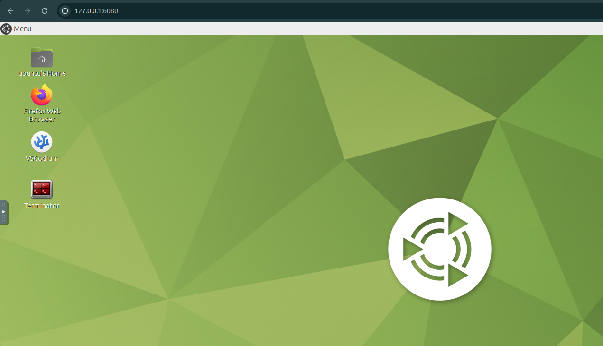

# Physical AI with Real Humanoids: Certified Unitree G1 & ROS 2 Training

## Workshop Environment Setup Guide

This workshop uses a **pre-configured Docker container** to provide a unified **Physical AI + ROS 2 Humble** development environment, designed for **real humanoid robots such as Unitree G1**.

The setup works consistently across:

- Ubuntu 22.04/24.04
- Windows 11
- macOS

Once the container is launched, you will get a **full Ubuntu desktop inside your web browser**, preloaded with ROS 2, Physical AI tooling, and workshop resources.

👉 Access URL:  
**http://127.0.0.1:6080/**

---

## 📑 Table of Contents

1. Overview  
2. System Requirements  
3. Docker Installation  
   - Ubuntu 22.04 LTS/24.04 LTS  
   - Windows 11 (WSL + Docker Desktop)  
   - macOS  
4. Run the Workshop Docker Container  
5. Access the Web-based Ubuntu Desktop  

---

## 1. Overview

This repository provides everything required to run the **Physical AI with Real Humanoids: Certified Unitree G1 & ROS 2 Training** workshop using a **Docker-based sandbox**.

The environment is designed to support:

- Physical AI workflows
- ROS 2 Humble development
- Humanoid robotics and embodied intelligence
- Simulation-to-real robot readiness (Unitree G1)

### What you need

- Docker installed
- One single `docker run` command

No local ROS installation is required.

---

## 2. System Requirements

- Ubuntu 22.04/24.04, Windows 11, or macOS
- 8 GB RAM (minimum recommended)
- 15 GB free disk space
- Modern web browser (Chrome recommended)
- Optional NVIDIA GPU for accelerated AI workloads

---

## 3. Docker Installation

Follow the instructions below based on your operating system.

---

## A. Ubuntu 22.04/24.04 LTS

A helper script is provided to install:

- Docker Engine
- NVIDIA Container Toolkit
- Required system dependencies

### Run the setup script

```bash
cd docker_setup_scripts
chmod +x setup_docker_ubuntu.sh
sudo ./setup_docker_ubuntu.sh
````

### Verify Docker

```bash
docker --version
```

---

## B. Windows 11 (WSL + Docker Desktop)

On Windows, the setup uses:

1. WSL 2 (Ubuntu 24.04)
2. Docker Desktop (WSL backend)

Docker should **not** be installed inside WSL.

---

### Step 1 — Install WSL (Ubuntu 24.04)

Open PowerShell as Administrator:

```powershell
wsl --install -d Ubuntu-24.04
```

If Ubuntu 24.04 is not listed:

```powershell
wsl --list --online
```

After installation:

* Reboot if prompted
* Launch Ubuntu 24.04
* Create your Linux username and password

---

### Step 2 — Install Docker Desktop

1. Download Docker Desktop:
   [https://www.docker.com/products/docker-desktop/](https://www.docker.com/products/docker-desktop/)
2. Install normally
3. Enable **Use the WSL 2 based engine**
4. Start Docker Desktop

---

### Step 3 — Enable WSL Integration

Docker Desktop → Settings → Resources → WSL Integration

Enable:

```
Ubuntu-24.04 → Enable integration
```

---

### Step 4 — Verify Installation

```bash
docker --version
```

---

## C. macOS

Docker Desktop is the recommended installation method.

Supported on:

* Intel Macs
* Apple Silicon (M1 / M2 / M3)

### Steps

1. Download Docker Desktop:
   [https://www.docker.com/products/docker-desktop/](https://www.docker.com/products/docker-desktop/)
2. Install and launch Docker
3. Verify:

```bash
docker --version
```

---

## 4. Run the Workshop Docker Container

Once Docker is installed on any operating system, run:

```bash
docker pull runtimerobotics/physical_ai_ros2_workshop:latest

docker run -p 6080:80 --security-opt seccomp=unconfined --shm-size=512m runtimerobotics/physical_ai_ros2_workshop:latest
```

This starts:

* A complete Ubuntu desktop inside Docker
* A web-based noVNC remote desktop
* A preconfigured Physical AI + ROS 2 environment

---

## 5. Access the Web-based Ubuntu Desktop

Open your browser and navigate to:

👉 **[http://127.0.0.1:6080/](http://127.0.0.1:6080/)**

You will see a **full Ubuntu desktop environment** running inside your browser, ready for the **Physical AI & Unitree G1 ROS 2 training**.

<p align="center">
  
</p>

